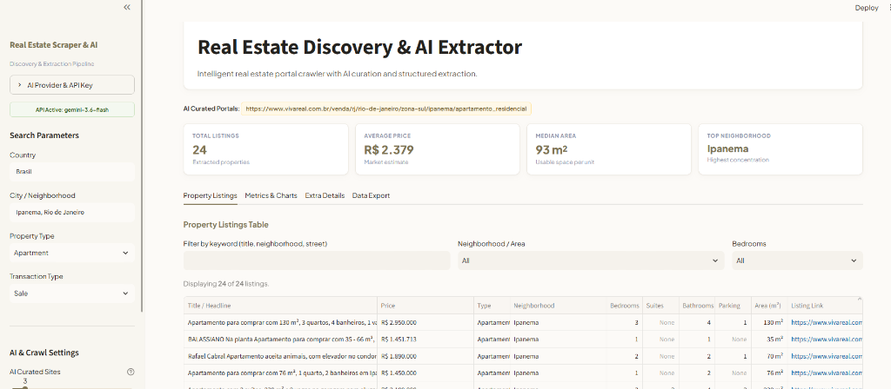
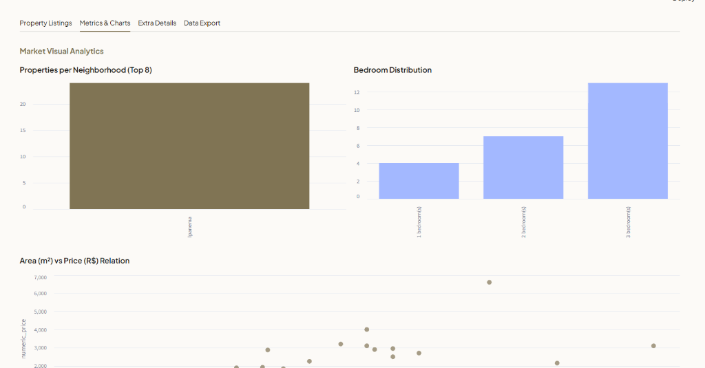

# Real Estate Scraper & AI Extractor

[](https://github.com/Kodomoppoi/Real-estate-Scrapper/releases)
[](https://www.python.org/)
[](LICENSE)

An intelligent, token-efficient pipeline designed to automatically discover real estate websites, crawl listing pages, and extract structured property data using LLM Structured Outputs.

---

## 📸 Screenshots


*Interactive Real Estate Explorer with KPI metrics, AI curated portals, and property listing tables.*


*Market Visual Analytics: Area vs. Price correlation, bedroom distributions, and neighborhood breakdowns.*

---

## 🏗️ Architecture

### Why AI?
Traditional web scrapers rely on brittle CSS/XPath selectors that constantly break whenever real estate portals change layouts, obfuscate class names, or render dynamic JavaScript feeds. 

By leveraging an **AI semantic extraction engine** with Pydantic structured outputs, this pipeline extracts clean, structured property data across any portal worldwide in any language without writing or maintaining site-specific scrapers.

```text
Location & Filters (e.g. Ipanema, Rio de Janeiro / Brasil)
       │
       ▼
1. Direct Listing Discovery (DuckDuckGo Engine - Scaled Candidates)
       │
       ▼
2. AI Pre-Curation & Index Matching (Preserves exact deep routes & filters noise)
       │
       ▼
3. Dual-Engine Crawler with Early Site Abandonment (Validates Page 1 first)
       │
       ▼
4. DOM Token Condensation (~75% Noise Reduction)
       │
       ▼
5. Country-Aware Structured Extraction (Suites, Amenities, Highlights, Financing)
       │
       ▼
6. Fail-Fast Resiliency, Pandas Deduplication & CSV/JSON Export
```

---

### Problems Solved in Pipeline Workflow:

#### 1. Search & Deep-Query Discovery
* **Problem Solved**: Real estate homepages are landing pages with complex search forms, while hardcoding portal URLs breaks across cities. The discovery engine performs targeted natural-language queries (e.g., `apartamentos a venda em Ipanema Rio de Janeiro`), retrieving live deep listing search URLs dynamically without form automation.

#### 2. Index-Matched AI Curation
* **Problem Solved**: Asking an LLM to rewrite or generate URLs causes link hallucinations or truncates deep paths to root domains (e.g. returning `zapimoveis.com.br/`). By numbering candidate URLs and having the LLM select 1-based integer indexes (`[1, 2]`), exact deep paths are preserved with 100% fidelity.

#### 3. Progressive Dual-Engine Crawling & Early Site Abandonment
* **Problem Solved**: Crawling multi-page routes on dead or anti-bot blocked portals wastes network time and AI tokens. Page 1 is validated first; if 0 listings are found or access is blocked, all remaining pages for that site are aborted immediately.

#### 4. DOM Token Condensation (~75% Noise Reduction)
* **Problem Solved**: Raw webpage HTML contains 80,000+ characters of SVGs, cookie banners, navigation menus, and ads. The regex cleaner strips noise and filters text to retain only property-relevant signals (`R$`, `m²`, `quartos`, `amenities`), fitting within fast LLM token windows.

#### 5. Country-Aware Structured Extraction
* **Problem Solved**: Property listings are unstructured and written in diverse regional formats. The Pydantic schema extracts normalized attributes (`price`, `area_m2`, `bedrooms`, `suites`, `amenities`, `financing_accepted`) localized to the target country's official language.

#### 6. Fail-Fast Resiliency & Multi-Format Export
* **Problem Solved**: Rate limits and quota exhaustion previously led to long wait loops. The engine enforces immediate fail-fast handling on critical errors and compiles extracted records into deduplicated Pandas DataFrames for instant CSV (`utf-8-sig`) and JSON export.

---

## 🚀 Quick Start

### Option 1: Run with Streamlit (Source Code)

```powershell
# 1. Clone the repository
git clone https://github.com/Kodomoppoi/Real-estate-Scrapper.git
cd Real-estate-Scrapper

# 2. Run the application (automatically activates .venv if available)
streamlit run app.py
```
*(Alternatively, you can run `python run.py` or double-click `Iniciar_App.bat`).*

---

### Option 2: Standalone Windows Executable (No Python Required)

For users who want to run the application without installing Python or dependencies:
1. Download **`RealEstateAI-v1.0.0-windows.zip`** from [GitHub Releases](https://github.com/Kodomoppoi/Real-estate-Scrapper/releases/tag/v1.0.0).
2. Extract the ZIP file and run **`RealEstateAI.exe`**.

---

## ⚙️ Configuration & API Keys

Configure your API key directly in the Web Dashboard sidebar or create a `.env` file in the project root:

```ini
# Google Gemini (Recommended - Free Tier available)
GEMINI_API_KEY=AIzaSy...
LLM_MODEL=gemini-3.6-flash

# Or OpenAI
OPENAI_API_KEY=sk-...
LLM_MODEL=gpt-4o-mini
```

---

## 🖥️ Web Dashboard Features

- **Real-Time Terminal Activity**: Live streaming terminal box embedded directly inside the browser showing search, crawling, and AI steps.
- **In-App API Key Manager**: Test and save Gemini or OpenAI API keys directly from the sidebar.
- **KPI Metrics Cards**: Total listings, estimated average market price, median area ($m^2$), and top neighborhood.
- **Interactive Listings Table**: Client-side keyword search, neighborhood filters, bedroom filters, and direct links to original ads.
- **Market Visual Analytics**: Distribution histograms by neighborhood and bedroom counts, alongside $m^2$ vs Price scatter plots.
- **Extra Details Tab**: Amenity frequency rankings, financing status breakdown, and Price-per-$m^2$ calculation rankings.
- **One-Click Export**: Export consolidated datasets to CSV (Excel compatible with `utf-8-sig`) and JSON.

---

## 🧪 Automated Testing

Run the automated test suite with pytest:

```powershell
pytest tests/
```
